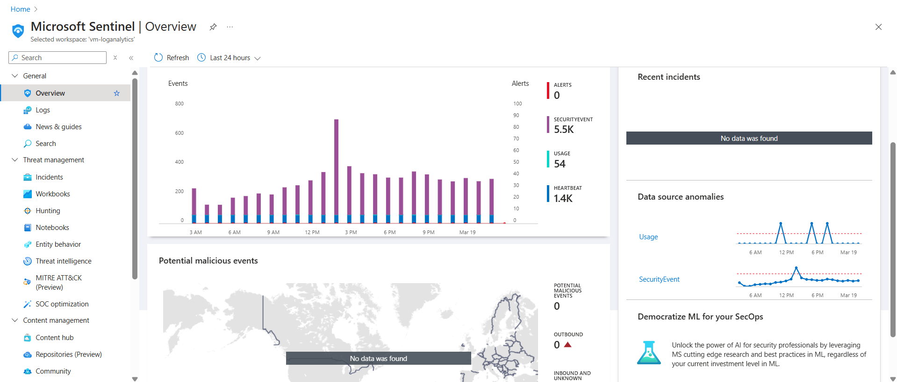
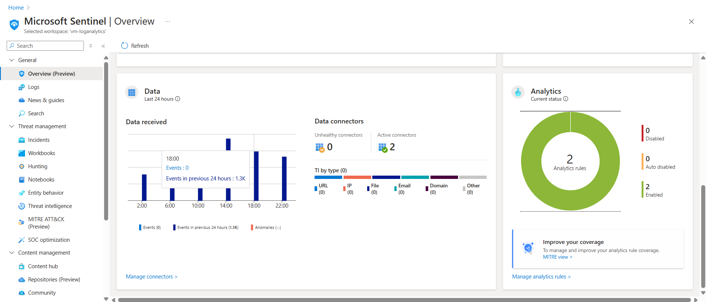
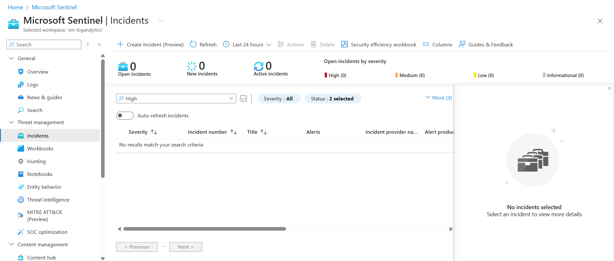
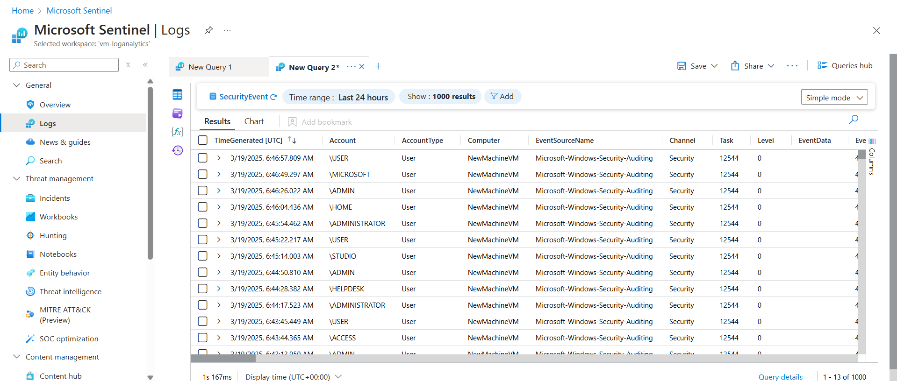

# Sentinel Guard

This project involved creating a **Security Operations Center (SOC)** by deploying **Microsoft Sentinel**, a **cloud-native SIEM (Security Information and Event Management)** platform. The system monitors and manages security events, generates alerts for potential threats, and integrates the **MITRE ATT&CK framework** for security incident management. The entire setup is built on **Microsoft Azure** and simulates a real-world environment to test cybersecurity measures.

## Project Overview

This project involved setting up a **Security Information and Event Management (SIEM)** system that efficiently monitors security events, generates alerts about potential security incidents. The key objective of this project was to simulate an operational **SOC** environment where cybersecurity professionals can detect, investigate, and respond to potential threats. Utilizing **Microsoft Sentinel** for real-time data collection, analysis, and incident management, this setup is designed to replicate real-world cybersecurity monitoring procedures, with a particular focus on **attack detection** and **alert escalation**.

Key highlights of this project include the integration of an **Azure Virtual Machine (VM)** to simulate a vulnerable system, real-time monitoring of **RDP (Remote Desktop Protocol)** connections, and the creation of custom alerts based on attack techniques identified in the **MITRE ATT&CK framework**. The system is automated with the added capability of escalating security events that are initially flagged with **medium severity** (e.g., **initial access**) to **high severity** if they meet certain criteria.

### Key Features:

- **Security Information and Event Management (SIEM)**: Built using **Microsoft Sentinel**, a cloud-native SIEM platform that enables the monitoring and analysis of security event data across various endpoints and systems.
- **Virtual Machine (VM) Simulation**: Deployed a **Windows Virtual Machine** on **Microsoft Azure** to simulate a real-world environment, with **RDP ports exposed** to attract potential security incidents, such as brute-force attacks and unauthorized logins.
- **Custom Alerting System**: Designed and implemented alert rules using the **MITRE ATT&CK framework** to monitor for specific threats such as unauthorized **RDP logins**. These alerts help to detect potential security incidents and vulnerabilities in real-time.
- **Real-Time Event Ingestion**: Configured **data connectors** to ingest security events from the deployed **VM** into **Microsoft Sentinel**, enabling real-time data analysis and efficient incident tracking.
- **Automation and Alert Escalation**: Added an automated workflow to escalate **medium-severity security events** (such as **initial access** or RDP login attempts) to **high severity** when certain thresholds are met, ensuring critical incidents are prioritized for investigation and response.

## Screenshots

Here are some screenshots of the **Microsoft Sentinel** environment:

1. **Sentinel Overview**:

   
   

2. **Sentinel Incidents**:

   

3. **Sentinel Security Events Logs**:

   

## Technologies Used

- **Microsoft Sentinel**: A **cloud-native SIEM** platform that provides scalable monitoring, alerting, and automated incident response capabilities.
- **Azure Virtual Machines**: Deployed a **Windows VM** on **Microsoft Azure** to replicate a production environment and simulate real-world security incidents.
- **Log Analytics Workspace**: Utilized to collect and store security logs from the **VM**, providing detailed insights into security activities and events.
- **MITRE ATT&CK Framework**: Leveraged this globally recognized framework to create custom detection rules and monitor attack techniques related to cybersecurity incidents.
- **RDP (Remote Desktop Protocol)**: Exposed **RDP ports** to simulate unauthorized access attempts, testing the system’s ability to identify brute-force login attacks and other intrusion attempts.
- **Azure Automation**: Automated the escalation process for security events, ensuring that medium-severity alerts were automatically upgraded to high-severity alerts for faster response and remediation.
